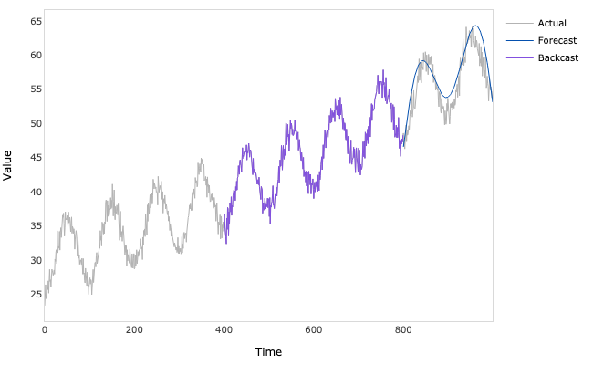
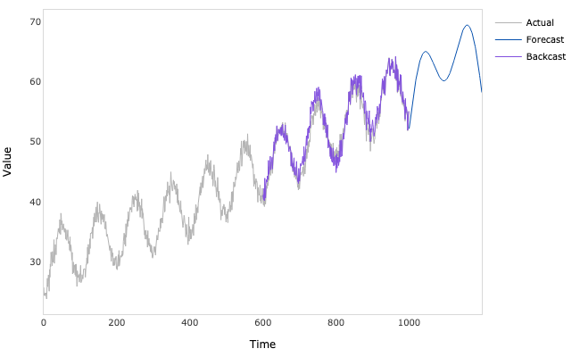

## N-BEATS TensorFlow

TensorFlow (Python) implementation of univariate time series forecasting model introduced in Oreshkin, B. N., Carpov, D.,
Chapados, N., & Bengio, Y. (2019). N-BEATS: Neural basis expansion analysis for interpretable time series forecasting.
[arXiv:1905.10437](https://arxiv.org/abs/1905.10437).

### Dependencies
```bash
pandas==1.3.4
numpy==1.19.5
tensorflow==2.6.0
plotly==5.3.1
```

### Usage

```python
import numpy as np
from nbeats_tensorflow.model import NBeats
from nbeats_tensorflow.plots import plot_results

# Generate a time series
N = 1000
t = np.linspace(0, 1, N)

trend = 30 + 20 * t + 10 * (t ** 2)
seasonality = 5 * np.cos(2 * np.pi * (10 * t - 0.5))
noise = np.random.normal(0, 1, N)

y = trend + seasonality + noise

# Fit the model
model = NBeats(
    target=y,
    forecast_period=200,
    lookback_period=400,
    hidden_units=28,
    stacks=['trend', 'seasonality'],
)

model.fit(
    epochs=100,
    batch_size=64,
    learning_rate=0.001
)
```

```python
# Plot the in-sample predictions
predictions = model.predict(index=800, return_backcast=True)
predictions_ = plot_results(predictions)
predictions_.write_image('predictions.png', width=650, height=400)
```

 
```python
# Plot the out-of-sample forecasts
forecasts = model.forecast(return_backcast=True)
forecasts_ = plot_results(forecasts)
forecasts_.write_image('forecasts.png', width=650, height=400)
```

